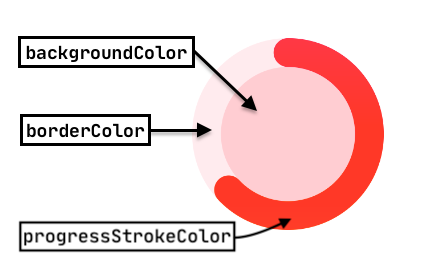

# Circular Progress View

## 🙈 _Gif_shots


## ​🌶 Want to use it in your project? Here's how to install:

[](https://android-arsenal.com/api?level=14)[ ](https://bintray.com/kishannareshpal/maven/circularprogressview/_latestVersion)

Add the library to the **dependencies { ... }** section of your **app** level `build.gradle` file:


```groovy
// Check the badge above to replace the version number :)
implementation 'com.kishannareshpal:circularprogressview:{version.number}'
```


## 🐌 Now, let's get started

### 🤡 Custom xml attributes for you!!

Add the view to your xml layout file.


```markup
<com.kishannareshpal.circularprogressview.CircularProgressView
        xmlns:cpv="http://schemas.android.com/apk/res-auto"
        android:id="@+id/progress"
        android:layout_width="48dp"
        android:layout_height="48dp"
        cpv:progressType="determinate"
        cpv:progressStrokeColor="@color/blue" />
```




<table>
  <thead>
    <tr>
      <th style="text-align:left"><b>XML Attributes</b>
      </th>
      <th style="text-align:left"><b>Description</b>
      </th>
      <th style="text-align:left"><b>Data Type</b>
      </th>
      <th style="text-align:left"><b>Possible Values</b>
      </th>
      <th style="text-align:left"><b>Default Value</b>
      </th>
      <th style="text-align:left"><b>Is Required?</b>
      </th>
    </tr>
  </thead>
  <tbody>
    <tr>
      <td style="text-align:left">progressType</td>
      <td style="text-align:left">
        <p><b>Determinate indicators</b> display how long a process will take. They
          should be used when the process completion rate can be detected.</p>
        <p></p>
        <p><b>Indeterminate indicators</b> express an unspecified amount of wait time.
          They should be used when progress isn&#x2019;t detectable, or if it&#x2019;s
          not necessary to indicate how long an activity will take.</p>
      </td>
      <td style="text-align:left">enum</td>
      <td style="text-align:left">
        <ul>
          <li><b>determinate</b>
          </li>
          <li><b>indeterminate</b>
          </li>
        </ul>
      </td>
      <td style="text-align:left"><b>indeterminate</b>
      </td>
      <td style="text-align:left">NO</td>
    </tr>
    <tr>
      <td style="text-align:left">progressStrokeColor</td>
      <td style="text-align:left">the color of the progress stroke indicator</td>
      <td style="text-align:left">color</td>
      <td style="text-align:left">n/a</td>
      <td style="text-align:left">#000000
        <br />(black)</td>
      <td style="text-align:left">NO</td>
    </tr>
    <tr>
      <td style="text-align:left">backgroundColor</td>
      <td style="text-align:left">the color between the stroke indicator</td>
      <td style="text-align:left">color</td>
      <td style="text-align:left">n/a</td>
      <td style="text-align:left">#FF000000
        <br />(transparent)</td>
      <td style="text-align:left">NO</td>
    </tr>
    <tr>
      <td style="text-align:left">borderColor</td>
      <td style="text-align:left">a light color used to highlight the stroke indicator path</td>
      <td style="text-align:left">color</td>
      <td style="text-align:left">n/a</td>
      <td style="text-align:left">#FF000000
        <br />(transparent)</td>
      <td style="text-align:left">NO</td>
    </tr>
    <tr>
      <td style="text-align:left">determinateProgressValue</td>
      <td style="text-align:left">sets the current progress value based on the provided <b>maxDeterminateProgressValue</b>*</td>
      <td
      style="text-align:left">float</td>
        <td style="text-align:left">n/a</td>
        <td style="text-align:left">n/a</td>
        <td style="text-align:left">NO</td>
    </tr>
    <tr>
      <td style="text-align:left">determinateProgressValuePercentage</td>
      <td style="text-align:left">sets the current progress value by percentage based on the provided <b>maxDeterminateProgressValue</b>*</td>
      <td
      style="text-align:left">float</td>
        <td style="text-align:left">n/a</td>
        <td style="text-align:left">n/a</td>
        <td style="text-align:left">NO</td>
    </tr>
    <tr>
      <td style="text-align:left">maxDeterminateProgressValue*</td>
      <td style="text-align:left">the maximum value of the progress indicator. Corresponds to 100%.</td>
      <td
      style="text-align:left">float</td>
        <td style="text-align:left">n/a</td>
        <td style="text-align:left">n/a</td>
        <td style="text-align:left">YES*</td>
    </tr>
    <tr>
      <td style="text-align:left">progressStrokePlacement</td>
      <td style="text-align:left">sets where the stroke indicator should be placed.</td>
      <td style="text-align:left">enum</td>
      <td style="text-align:left">
        <ul>
          <li>outside</li>
          <li>inside</li>
          <li>center</li>
        </ul>
      </td>
      <td style="text-align:left">inside</td>
      <td style="text-align:left">NO</td>
    </tr>
  </tbody>
</table>\* It is required when you set either `determinateProgressValue` or `determinateProgressValuePercentage`.


### 🥢 Here is a list of all available methods.

<table>
  <thead>
    <tr>
      <th style="text-align:left"><b>Return type</b>
      </th>
      <th style="text-align:left"><b>Method &amp; Description</b>
      </th>
    </tr>
  </thead>
  <tbody>
    <tr>
      <td style="text-align:left">boolean</td>
      <td style="text-align:left">
        <p><b><code>isIndeterminate()</code></b>
        </p>
        <p>Returns whether the progress type is <b>ProgressType.INDETERMINATE</b>
        </p>
      </td>
    </tr>
    <tr>
      <td style="text-align:left">void</td>
      <td style="text-align:left">
        <p><b><code>setBackgroundColor(int colorInt)</code></b>
        </p>
        <p>Changes the current backgroundColor to the specified one.</p>
      </td>
    </tr>
    <tr>
      <td style="text-align:left">void</td>
      <td style="text-align:left">
        <p><b><code>setBorderColor(int colorInt)</code></b>
        </p>
        <p>Changes the current borderColor to the specified one.</p>
      </td>
    </tr>
    <tr>
      <td style="text-align:left">void</td>
      <td style="text-align:left">
        <p><b><code>setProgressStrokeColor(int colorInt)</code></b>
        </p>
        <p>Change the stroke color of the progress.</p>
      </td>
    </tr>
    <tr>
      <td style="text-align:left">void</td>
      <td style="text-align:left">
        <p><b><code>setStrokePlacement(StrokePlacement strokePlacement)</code></b>
        </p>
        <p>Change the stroke position to be either <b>StrokePlacement.OUTSIDE,</b>  <b>StrokePlacement.INSIDE</b> or <b>StrokePlacement.CENTER.</b>
        </p>
      </td>
    </tr>
    <tr>
      <td style="text-align:left">void</td>
      <td style="text-align:left">
        <p><b><code>setProgressType(ProgressType progressType)</code></b>
        </p>
        <p>Change the progress type to be either <b>ProgressType.DETERMINATE, ProgressType.INDETERMINATE.</b>
        </p>
      </td>
    </tr>
    <tr>
      <td style="text-align:left">void</td>
      <td style="text-align:left">
        <p><b><code>pauseIndeterminateAnimation(boolean hideStroke)</code></b>
        </p>
        <p>Pauses the indeterminate stroke animation to the current position. If <b>hideStroke is true</b> it
          will hide the stroke automatically when paused.</p>
        <p></p>
        <p><b><code>resumeIndeterminateAnimation()</code></b>
        </p>
        <p>Resumes the paused indeterminate stroke animation.</p>
        <p></p>
        <p><b><code>toggleIndeterminateAnimation()</code></b>
        </p>
        <p>Toggles the indeterminate animation.</p>
      </td>
    </tr>
    <tr>
      <td style="text-align:left">void</td>
      <td style="text-align:left">
        <p><b><code>pauseIndeterminateAnimation()</code></b>
        </p>
        <p>Resumes the paused indeterminate stroke animation.</p>
      </td>
    </tr>
    <tr>
      <td style="text-align:left">void</td>
      <td style="text-align:left">
        <p><b><code>setRange(int maximumProgressValue)</code></b>
        </p>
        <p>Sets the maximum allowed progress value. Should be &gt; 0</p>
      </td>
    </tr>
    <tr>
      <td style="text-align:left">void</td>
      <td style="text-align:left">
        <p><b><code>setProgress(float progressPercentage, boolean animated)</code></b>
        </p>
        <p>Sets the current progress value by the percentage. If <b>animated is true</b> it
          will animate the progress change.</p>
        <p></p>
        <p><b><code>setProgress(float progressPercentage)</code></b>
        </p>
        <p>Sets the current progress value by the percentage, without animating the
          change.</p>
        <p></p>
        <p>&#x1F4A1; Use this static method<b><code>(float) calcProgressValuePercentageOf(int value, int maxValue)</code></b>to
          get the progressPercentage.</p>
      </td>
    </tr>
  </tbody>
</table>

### 🏃🏾‍♂️ Lets see it in action


```java
CircularProgressView cpv = findViewById(R.id.cpv);
```


```java
// You can color the background, the stroke and the border.
// Multiple colors for gradient.
int[] gradientColors = new int[] {
    Color.parseColor("#ff9100"), // orange
    Color.parseColor("#ff1744") // red
};

cpv.setBackgroundColor(Color.parseColor("#ffcdd2")); // light red
cpv.setBorderColor(Color.parseColor("#ffebee")); // lighter red
cpv.setProgressStrokeColor(gradientColors); // a gradient of red and orange

// Or pass just a single color for a solid progressStrokeColor.
/* cpv.setProgressStrokeColor(Color.parseColor("#ff1744")); */
```


```java
// For choosing where the progressStroke is placed with:
cpv.setStrokePlacement(StrokePlacement.OUTSIDE);
/* cpv.setStrokePlacement(StrokePlacement.CENTER); */
/* cpv.setStrokePlacement(StrokePlacement.INSIDE); */
```

![Example of OUTSIDE   &#x2013;  CENTER   &#x2013;   INSIDE \(Gradient progressStrokeColor and a backgroundColor set\)](data:image/jpeg;base64,/9j/4AAQSkZJRgABAQAAAQABAAD/2wBDAAMCAgICAgMCAgIDAwMDBAYEBAQEBAgGBgUGCQgKCgkICQkKDA8MCgsOCwkJDRENDg8QEBEQCgwSExIQEw8QEBD/2wBDAQMDAwQDBAgEBAgQCwkLEBAQEBAQEBAQEBAQEBAQEBAQEBAQEBAQEBAQEBAQEBAQEBAQEBAQEBAQEBAQEBAQEBD/wAARCACsA5YDASIAAhEBAxEB/8QAHQABAAEEAwEAAAAAAAAAAAAAAAYEBQcIAQIJA//EAEIQAAIBAwIEAwUEBwUIAwAAAAABAgMEBQYRBxIhMRNBUQgiYXGBFDJSkRUjQqGxwdEWYnKSohckU3OCk+HwMzXi/8QAHAEBAAEFAQEAAAAAAAAAAAAAAAQCAwUGBwEI/8QANREBAAEDAgQDBwIFBQEAAAAAAAECAwQFEQYSITFBUXEHEzJhgZGhscEUFSIj4TNCstHwUv/aAAwDAQACEQMRAD8A9TLGxs8bZ0cfj7anb21vBU6VKnFRjCKWySSPuAAAAAAAAAAAAAAAAAAAAAAAAAAAAAAAAAAAAAAAAAAAAAAAAABQ4vB4fCK4WIxltZq7rSuK/g01HxKsu8nt3ZXAA33AAAAAAAAAAAAAAAAAAAAAAAAAAAAAAAAAAAAAAAAAAAAAAAAUP6ExH6X/AE/+jbb9JeD9m+1eGvF8Lffl5u+25XAA33AAAAAAAAAAAAAAAAAAAAAAAAAAAAAAAAAAAAAAAAAAAAAAAAWzO6awGp7enaagxFrkKNKfiQhXpqSjLZrdfRsFzANwAAAAAAAAAAAAAAAAAAAAAAAAAw3xm9oOx4cV1g8NaQyOYlFVJQcmoUIdOsuj779vgQ87UMbTbM38quKaY8ZTtO03K1W/GNiUc1c/+3nyZkBpbT9r/ifGsnXx2Eqw36w8Gcd/rzdCZ4H22cZCSp6t0hcW6kltVs7hVvPZvkcYvZbrs2a/j8b6HkV8kX4ifnu2W/7P+ILFPP7jm9JiZ+zZ8EK0Txh4f8QIRenNRW1arJbu2nLw60fnCW0v3E0TTW6Nns37eRRz2qomPk1G9Yu41c271M01R4TG0uQAXVoAAAAAAAAAAAAAAAAAAAAAAAAAAAAAAAAAAAAAAAAAAAAAAAAAAAAAAAAAAAAAAAAAAAAAAAAAAAAAAAAAAAAAAAABw2oreTSXqy13WpMbbtwjOVWS8oLp+Z5MxHdXRbruTtRG66gi1fV1xJJW9pCn6uUnLf5dEU8tVZV/d8FL/B/5KPeUpdOnZFUb7flMQQ3+1GW/HS/7Z96GrrunFKvaU6r9Yy5P6iLtMvatNyKY323SsFrtNR4u6ahKuqNR/sz6fv7FzTTSae6fZlcTv2Qq6Krc8tUbS5AB6pAAAAAAAAAAAAAAAAAAAAAAAAAAAAAAAAAAAAAAAAADiUowXNOSil5t7Acnnxxhdy+JuoXeNur9sa/6VGKh/p2N8aup8ZTnyKVSp6OEd9zCnGjhVh+JdzHOYqvKyy8KfK5VKe9Osl91S2e6a67P4+Zo3Huh39d06mjFneuirmiPPptt36d3QvZ7q1vQtTqry6Ziiunl327dYnf06NPpfeba23ZT1pxjP3mZLyvAPiLjGpxsbW6i29421dNpbb77S26fUx3mcJmcJcfZ8ziLm0ae0fGpyhzPz2fZ/Q4Xe4d1PEn+/Zqh9GYOtafm7Rj3qap9VsjKrSqqtb1Z0qsHvGcJNSi/g0Zr4Y+1XrfQzo2GqJT1Fh4OMG6lTa8op/tRm/8A5Evwy6/3jCie3dnSpspP0N54Yzb2lUU1UT6x4T6+nVTq/DencQWvdZtuKvKfGPR6b6H1/pTiLhKWf0nlYXtrUS5tltOnLbrGce8ZL0ZIjzI0BxA1Vw21DS1HpXJTo1I+7XtpdaN1D8NSPnt12fRrfoegXCbitp3i7palqTAt0asX4d5ZVJb1bSr+CXr6qS6NHYtO1G3n0bx0nyfNPGHBWXwtdiv47NXar9p8vl5pqADJNJAAAAAAAAAAAAAAAAAAAAAAAAAAAAAAAAACnvr63x9B17iaS32S82/RDs9ppmqdo7qgo7vLY+xco3FzFTjtvBdZfkRfJ6ku75SpUd6FFvsn7z+bLQWaru3ZlbOmTMb3Z2+UJXU1haLfwrSrLbtu0t/4nxes35Y5f97/APJGgW5uVSmxp+PHh+ZSaGsouW1THtR9Y1N3/ArbXVGMuOlWUqEvSa6P6ohgPYu1Q8r06xVHSNvqyTCcKkVOElKL6po7GPLO/u7GfPa1pQ9V5P5olGI1JSvWre6iqVbyafuy/oXabkVdGMyNPuWY5qesL2AC4gAAAAAAAAAAAAAAAAAAAAAAAAAAAAAAAAAAAFryWoLTH+5D9dW3+4ntt82Ueez8raUrOxl+tj0nL8L9PmRctV3OXpDJ4WB76Oe52/VU3+Ru8jVVS5qJqO/LFLoimAI8zM9ZZ2iim3Ty0xtAAArAAAKmxyV3j6nPbVWk/vQfWL+aKYCJmOsKK6KblPLVG8JpiM/b5Tam4OjW235G99/ky6GN95JqUZOLXZp9iVYLP/anGyvZJVdtoT3+/wDB/H+JIouc3SWBzMCbG9dHwr8AC6xoAAAAAAAAAAAAAAAAAAAAAAAAAAAAAAAAAAABF9R5p1JTx1s2ox6VJJ/e+B5MxTG8r1ixVfr5KVRldTQoy8HHyU5LvPbeO5G69xXuZupXqynJ+bZ8wR6qpqbJYxbePG1MdfMABSkhR5XE47N2VTH5Wyo3VvUW0qdWClF/RlYDyYiqNpexVNM7x3a+cS/ZstZWtTLaDUadeG852L92El6Qe+0X8+nxRrnd21WyvK1nc05Uq1KXLKE1tJNeqPQ8xHxt4OWmtbGrncRRhSzNvBvmS28eK29x/H0fU1TVuHbdyJvYsbT5eH+HTeEuObuNcpxNTq5qJ6RVPen184/RqRvsSvhjxJznCvV1tqnCylUpxapX1o37lzQfeL8lJd4y8mvRtEXnTlTqOE4uLi9mn3TO0EvQw2BduYt+KqfB17VNOx9WxasTJp5qKo/9Pq9RdPZ7F6pwdjqLCXUbmwyNGNxb1Y/tQkt18n6r1LiaiexnxLq2GSu+FuYvN7a5UrzDqcvuTS3rUo9fPfnSS7qb8zbs6ZauRdoiqHxtrmkXtCz7mDe70z3848JAAXGJAAAAAAAAAAAAAAAAAAAAAAAAAAAAOJSjCLlJ7JdWwKXJ5GljbWVeps5bbQj+J+hB76+r5Cu69eW7fZeSR98zkf0leyrR3VOKUYJ+nr9WUBGuV807R2bFhYkWKear4p/AAC2nAAAAAAAAJJp3Oy542F5Pfme1Ob9fRknMaE005lHf2jpVn+uodG/xR8n/ACL9uvfpLC6hiRR/do7eK7gAvMSAAAAAAAAAAAAAAAAAAAAAAAAAAAAABZ9RZWVhQjQor9bWT2l+FLzLtUqQpU5VJvaMVu2QC+vKl/dVLqotnN9I777L0Ldyrljon4GPF+5vV2h8AARmyAAAAAAAAAAAHG25yAJhp3K1MhbulcPetRSTf4l6l4IDjLydhe0rhS2jF7TXrHzJ7GUZxU4vdSW6fqiVbq5oaznWPcXenaezkAFaEAAAAAAAAAAAAAAAAAAAAAAAAAAAAAAAAt2cv1Y2M5R61J+7Fb+vdkIbbe7LzqqvOeRVB/dpxTXX1LMWLk7y2PTbUW7PN4yAAtsgAAAAAAAA1S9pTQVPTuooaoxtJwtMs340UukKyS3fykv3p+ph2L6Jo3Z4yaaWqeHmVsI03OtTpqvRUe7qQfMkvTfbbf03NJttn0RqOr4vusj3lPi75wDrFWoaZ7m58VqeX6eH46fRWYjPZDSeo8NqzGOX2jDX1O7UYvZ1IxfvQ38lKO6fwZ6f4jI2uWxlrk7Kop0LujCvSl6wmt0/yZ5a1k+R/A9IuDGKyeE4T6SxOZpOne2mItqNaD7wagtov5LZGc0Sqqaaolzj2xYlq3lY+TT8VUTE/TZNAAZ1xcAAAAAAAAAAAAAAAAAAAAAAAAAAAsmqr129lG2g/euG0/8ACu5eyF6pryqZWVJt8tKMUk/LdJ/zKLk7UpmBbi5fjfw6rQACK2QAAAAAAAAAAArcPeysMhSr820G+Sp6cr7/ANfoUQETtO6muiK6ZpntLJSaaTTTT6po5KLC3ErrF29aTbk47NvzabX8itJkTvG7U66ZoqmmfAAB6pAAAAAAAAAAAAAAAAAAAAAAAAAABYtW3XhWULVPrcS6/KOz/oRQvWq6znkI0X2p0019SykW5O9TZdPtxRYifPqAAoTgAAAAAAAAAAACy6q1ZiNH415TM1/Dpb8sUlvKcvwxXm/gW7t2ixRNy5O1Md5lXbt13q4t243me0QvRLtKXrusa6M/vW8vD+mya/iao3HtP3avZKz0nTnap9PFunGTX0i9jOHBTiTgtcxuamNqTpVowTr29Rrem12fo0+vVejMfpPEOm6rXNvEuxVPkcQ6BqGBjxdybc0xHj09PBlgAGwtJAAAAAAAAAAAAAAAAAAAAAAAAAAAAAAAAQHLf/Z3X/Ol/EpSry26yl3v/wAWRSEaru23H/0qdvKAAFK8AAAAAAAAGPdd+yVpvVt5LOaXy8sBdXkfEqUlQ8WhObe7mo80eVvz2fXp57t5CMhWkeW0oxa22pxX7j33NF7pXCxXrGdo1ym9g3Joq67/ADj5xPSfq194a+x5prSOZo5/WGbWpbm0nCtaUXaeDQpVY7+/KPNJz68rSb6NGxABft26bUctEbMFqOqZmrX5yM2ua658Z/x0AAVoAAAAAAAAAAAAAAAAAAAAAAAAAAABj/LVFVyVzOPZ1GZAMe5KnKlkLiEu6qSf7yze7MppW3vKvRTAAsM4AAAAAAAAAAAAAJjpOpz4tx225Kso/Pon/MvRZNIxaxk2196tJr8ol7JdHww1fL2i/Vt5gAKkcAAAAAAAAAAAAAAAAAAAAAAAAOJb7dN/ocgDDnFPiFhNB3dW4ynPUqVtvBoU379VrZNR36dN/NoxNR9p+0d1ThX0pUVvKTTlG7XiRj67OKW/w3IZ7St3WnxZylKUt40adGMF6Jw3MWOtLfptscM4g481LD1S5j48RFFuqY2nrvs+iuG+CMDL0mzkX96qq6YnvttvDejT+ocVqfF0svhrpV7ar0T84y84teTXoXI159l/MVv0pmcL4zdGpQhdcj8qily7r/pa3+SNhjq2lZv8xw7eVttzRu5zq2B/LM25i778s/tuAAyDHAAAAAAAABrr7T95OOWw9q5ycI06lSME9lu+Vbv6GxRrJ7TtzSlq6wtudc9K1cmt+yk1t/Bmle0CdtBu+tP/ACht3AtHPrdr0q/4yw94k299+5lr2ZMtWsuMuFoUJrkvKdzb1Vt3j4UpL98UYglVjHt1Zk/2ZoyuONmnvCjuqf2ibfw8CZyfgbenXsfbxmf0dR45txPD+Tv/APLfoAH00+TQAAAAAAAAAAAAAAAAAAAAAAAAAAAAAAAEN1NbOjknVfast109C0kz1HYu8sHOnHepQfPFeq8yGEeuNpbJp973tmI8Y6AAKE8AAAAAAAB9bShO5u6NvB9ZzS7bmQkklslskRjSdg5VZ5CaXLH3Kb+PmSgkW42hreo3feXto8AAFaAAAAAAAAAAAAAAAAAAAAAAAAAAAAAABCtT0HSy1Se3u1VGS/LZ/wAP3k1LDqyyda1hdwg3Ki9pNfhZRcjelN0+57u/G/j0RIAEVsYAAAAAAAAAAAITxC4sae4feHa3Sd5kK0XOFpTls1H8U3s+VN9F06mPMP7T1zUvEsro2MqDnHrbXa54x8+k47Sf1X1MJl8RaZg5EYmRdiK58Os/pDMYvD+pZticmxamafp19G2uCoTt8TbU6nflcv8AM2/5leWPRWq8VrXTVnqPDTbtblSUU+8HGTi4v4prb0+fcvhstuqmuiKqJ3iY6Oe5FNdF2qm7G1UTO8eU+IACtZAAAAAAAAAAAAAAAAAAAAAAAADiS5ltucgHdpF7W+Jni+KMb+UP1eQsqck0u8obp/u5TCUqyT2S3Nu/bL0lUvtMY7V1tS9/E1nCtUXdUam0Wv8ANszTtTez6HzpxzpFyzrl2qin+mvaqPtG/wCYl9W+znNp1Dh6x13qo3pn6T0/EwyLwN1HRwXEnHTrzcaN0p2r283NbR/1cpuMefdpd1LK5p3dvUlTrUnzQkv2ZLs/j1N3+HWrrbW+kLDO0ailWlTVK6iltyV4pKa/Pqvg0dB4Av1Rp38Ld+Knrt8plpftF02qxmUZkR/TXG0+sJKADfXOQAAAAAAAA0p405+Of4jZS5tqnPRtnGzjLo93T3Uuv+JyX0NouLWs7bQ2jrzMSrRjc8rpW0HvvOpLolsvzfwTNJp3MqtSdavNyqVJOc5Pzk3u2c/47mcmxbw6fGd59PD8urezLTKqrt3Uao/piOWPWesiqSX3luZ59jTEVMnxRuMvKL8PE4yq9/79WSgv9KmYElVjs2urRub7FOkJ4nh9fauuqTVbUF3vRk11+z0lyR+jn4jMLwLoXu9R/id+lMMr7VdQpxNEmx2m5MRH7/hsUADs75hAAAAAAAAAAAAAAAAAAAAAAAAAAAAAAAACH53CSsajuLeO9Cb32X7Hw+RMDrUpwqwdOpFSjJbNPzKaqeaF/HyKsevmhjkF8yumq9u3Xsk6tN7twS6x+XqWNpp7NbNFiaZp7tms36L9PNRIACleAAAKnHY65ydwqNBbRXWc32iioxmDu8l76To0t/vzj/BeZMLOzt7C3jbW0OWEfzb9X8S7RRv1liczUIpjktT183e3oU7ahC3ox2hTioxXwR9AC8wQAAAAAAAAAAAAAAAAAAAAAAAAAAAAAAAAdK1KFelOjUScZpppncAidusMeZCznYXdS2mn7r6N+a8inJ1msTDKW+0UlWhu6bfT6MhFajVoVZUa0HCcHtKL8iLXRyy2XDyYyKOveO//AG6AAoSwAAAAALRq3UlnpDT15qK/i5UbOMW4p7OUpSUIrz7ykkXcxn7RONuchwyvKltHmdlcUbqfwgm039Obcg6lfrxcO7et/FTTMx6xCbptijKzLVi58NVURPpMtZdQ6gvdTZu6z18/191U5mt9+VJbJfHZJdSjVddOj+JbaVeUOVbtxXlsXXEY3J53KWuHwtjUvLy9k4UKVN7OTS36vsktm230STb6I+XrePe1PLi3H9Vdyr7zMvpjImxpmLNVXSiiPtEQ2m9i+9vK2M1PZOTdpQr29WKltvGrOM1LZ+jjCHfzXxZsoQbg1w6ocM9DWen3yTvW5Vb6vGKXjVnJ9endJbRTfXljFeSSnJ9WaVjVYeDZx6+9NMR9ofIGu5lGfqV7Jt9qqpmAAGQYkAAAAAAAAAAAAAAAAAAAAAAAAAAFk1npiw1jprIadyNCNWje0J0ZRkunvLY809UYLJaT1Bfacyi5bmxquEtl0lHvGX/VHZ/U9RzWj2t+C91qKxXEfTVq6uQxtFq9t6cPfuKCa7eso7ykl5rmW/ZGtcS6ROo2Iu2/jo/MeMfv+HUPZjxVToefOFlTtZu+M/7ao32nt49p+k+DTtVKi6b9zIHB/izdcNM5y3kZVsNfuNO7pJ9ab36VY/GO73Xmm/NJGPYOMkpR7M5a5lszRsGu5gXYqo7vorVNJx9YxasfIjeJjw+/6vQrF5KyzGPt8pjbqnc2t1TVSlWpveM4vs0VRpPwq4xai4WVJWlOjLJ4Gb56tg5bTpPznSk+kfjHt8u5tloriNpHiBZ/a9NZWNacIqVW2qLkr0d+3PB9V8+z8mdFxM23l07x38nzxrnDeZoVza9TvRParw+vlKTAAmNfAAAKPLZbHYPH18rlbunbWtvFzqVJvZJIsetuJGlNA2rr57JQhWa5qdtB71anyX9TVHifxdz/ABGrRoXH+64ui26VpF7uXpKbW27+HZbLuQMzPt4lM79Z8m0cPcK5mvXIqpiabXjVP7ec/o+XFriXdcSNQ/aYSnDGWe8LSk30e/ee3x2XTyIOcLc4nJU4Ocnsl3NAyqbmXdm5VO9UvoXDxcfS8SmxZjaiiP8AMz+65ab0tltcanxWj8HHe8ytxGjH3d1ThvvOo/hCKcn8j040zp7G6T09jtM4el4VljLana0I+kILZGAPZB4L3Ol8PU4m6ssfCzWap8uPoVI7SsrJ9eq/ZnUaTafVJRXTqjZFJLojoOh6bGn4/wDV8VXWXy/7ROJo4h1OaLE/2rfSPnPjLkAGac/AAAAAAAAAAAAAAAAAAAAAAAAAAAAAAAAAAAKS9xVhfp/abeLl+JdGirAVU1TRO9M7I/W0hQlJuheTpr0lDm/mj4PR9Tfpfx2/5f8A5JOCnkp8kiM3Ij/cjlHSEU96945L0jDb+Zc7PB46yanToKVRfty6v+hcAexTEdlFzJu3Y2qqAAerAAAAAAAAAAAAAAAAAAAAAAAAAAAAAAAAAAAAAAFvy2HoZWltN8lWK9yaXb5/AuAPJjfpKqiuq3VFVM7SgGQxN5jajjWptw36VIr3X/QozJMoRnFwnFSi+6a3TLRdaXxtw+akpUG+/J1X5Ms1WvJmLOpxPS7H1hDQX+40hdxn/utxTqR/v+61/E+P9k8p60P87/oW+SryTYzLExvzQswL0tJ5Pdc0qKXntL/wV9DR1CMk7m8nUX4YR5f37s9i3VPgprzrFEfEi8YynJRhFyb8kt2X2z0jTvbadPLJeHWg4Ok1GSafRp90015ejJHaYyxsY8ttbxi33k+rf1ZUpJdEXKbUeLHX9Tqq6Wunz8WuWpfYt0pkr6V5prUc8JCpLmnbqz8elH15E6kXHd9dm2l5bLZKd8LfZ50XwwuZ5S358nk5bqN3cx2dKLSTjCO7UV0336y6vrtsllMEKxoun41+cizapiufGIX8viTVs6xGNk36qqPKZ8gAGTYQAAAAAAAAAAAAAAAAAAAAAAAAAAAAADpWo069N0qkU4yWzTO4A0s9pH2dbrSl7X1xomx8XDXEue7s6S960n5zivOD7tLrF7+XbXfbqz1ZnCNSLhOKcX3TNZ+MXsjY/OVLrU3DadDHX9durWx0/ct60/OUX+xOT38tn07PdvWdU0OL8+9s9/J3Dgb2m04tunTtZnpHSmv5eVX7T9/Np8d7evcWl1TvbO5r29xSe8K1Go4Tj8pLqiuzuns3pm/qYrUGLubC8pfepV4OL+a8pL4rdFv2bW+xqlVi9Zq27TDu1F7HzbXPTMVUVfWJ/wC2S9Pe0TxMwMYULjI2+UoRXLtd0t6my7bTTX70yaUPa4yCglcaKt5T83TvGk/o49PzZr937o5UCdRqWZRTtFTW8ng3Q8q5z1WIj0maf0mGf7n2tclOny2ujaFOb/alduW3+kheo/aG4m56lK2oZWhi6E/vfY6HLUa9HOTfT5JGNeX4jl+J5c1LNuRtzbemy5jcGaHi1c1uxEz85mr9Zl9bi7urytO5vbirXrVHvKpVm5yl82+rPk3uNkurZWYPB5rU2Rp4fTGEvcrf1X7tC1pOTS85SfaMV6yaXxI1Nq9kTtHXdnMjIxtOszcvVRRRTHj0iIUb2jByl0S7s2M9mr2b62qrq04i8QLFww1HavjMdWjtK7l+zWqRa6U115V3l37d5nwV9kKwwN5Q1XxT8DJ5KhJTtsXTlz2ltJPdSn/xpp+u0V6N7NbLxhCnFwpqMYxS2Sj2/wDeht2l6RTYiLl2Or5/459pE6jFWBpU7W/GrtNXyj5O0IQpwUKcVGMVsklskdjjdNtehyZ9x3uAAAAAAAAAAAAAAAAAAAAAAAAAAAAAAAAAAAAAAAAAAAAAAAAAAAAAAAAAAAAAAAAAAAAAAAAAAAAAAAAAAAAAAAAAAAAAAAAAAAAAAAAAAAAAAAAAAAAAAAAAAAAAAAAAAAAAAAAAACP6u0DpDXdg8bqrA2uQo7NR8WHvQb84yXWL9GuqMAa09ijE3Mql3oXU9xZc0m42V5HxqUF6Rnvz/wCZy+hs+Czex7V+OW5G7NaVxDqeiVc2Demn5d4+09GhGX9kzjRi51PsuIsMnCGz3tbyKbTfTZTUev8A7uQ6+4P8VsbUVG74e5qM2t9oUY1P3wk0elAIP8nxfCPy3ex7W9dtU8tyKKvntMT+v7PNO04R8Vr6t4Nrw5z05ertlFfnJpEzw/sm8bcu4utgrDF033le30FJfKNPnf57dzfkCNIxY8J+6m/7WdduRtaiin57bz+Z/Zq7pD2H8JbOlX11qy7yjhs3a2dP7NSfrGUuaU5fNOPn8DYXSOhtJaExyxWkcBZ4u2XeFvT5ed+sn3k/i92X0E61j27EbURs0fVNd1HWaubOvTX8pnp9uwAC8xAAAAAAAAAAAAAAAAAAAALFobNXmo9HYbO5BU1c31nTr1VTi1HmkuuybexfQAAAAAAAAAAAAAAAAAAAAAAAAAAAAAAAAAAAAAAAAAAAAAAAAAIJwq1rmNZ09Qyy8LZPGZitZUPBg4/qopbb7t7vr3J2Hsxt0AAHgAAAAAAAAAAAAAAAAAAAAAAAAAAAAAAAAAAAAAAAAAAAAAAg39tMv/ti/sJyW36N/Q327fkfi+Lz7fe32228tich7MbdAAB4AAAAAAAAAAAAAAAAAAAAAAAAAAAAAAAAAAAAAAAAAAAAAAMacdOIWf4eYHHZDT6tfGurt0ZuvTc1yqDfRbrzSAexG7//2Q==)

```java
// Lets suppose you are downloading a file, and you want to show a progress:
cpv.setProgressType(ProgressType.DETERMINATE)

int totalBytes = 349022; // the maximum value of the progress
cpv.setRange(totalBytes);

// Update the progress using:
cpv.setProgress(10.0f, true) // 10% of the maximum value of the progress.

// Or if you want to update the progress using a value out of the total.
int downloadedBytes = 1230; // downloaded 1230 bytes out of the total of 349022;
int p = CircularProgressView.calcProgressValuePercentageOf(downloadedBytes, totalBytes)
cpv.setProgress(p, true);
```


